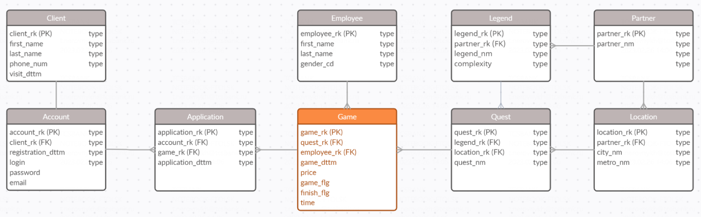
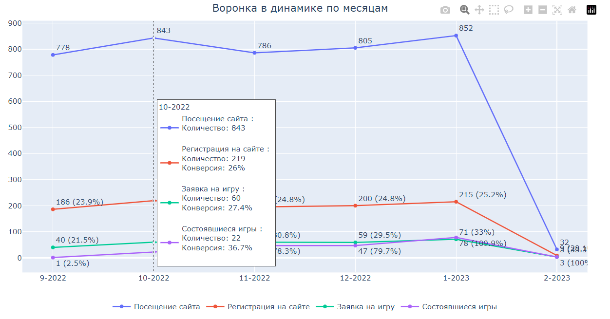
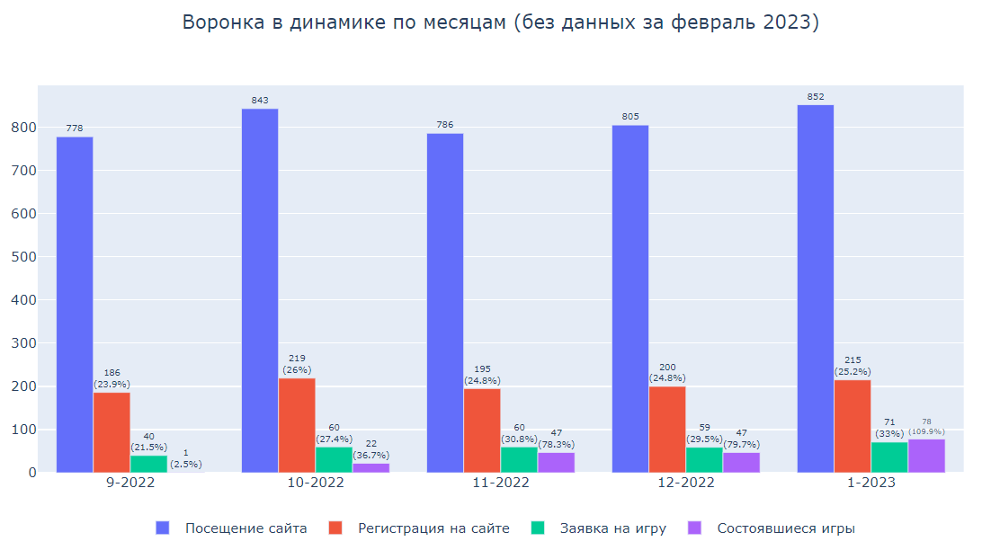
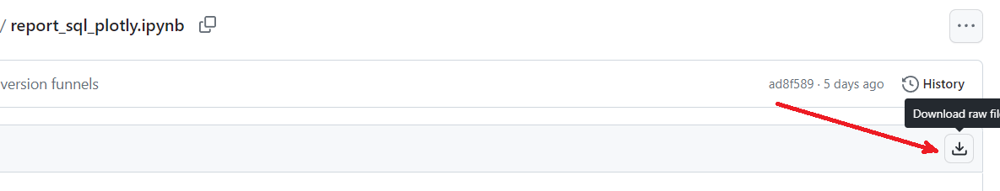

# Визуализация воронок конверсии

Данный проект выполнен в рамках курса "Анализ данных в индустрии" от Tinkoff.

## Описание проекта

Дана база данных проекта "Тинькофф квест" со следующей структурой:

Необходимо построить воронки, которые показывали бы в динамике по неделям и месяцам, сколько клиентов посещает сайт, и какая доля из них регистрируется на нем \ подает заявку на игру \ фактически приходит на нее. Количество клиентов и конверсии необходимо изобразить на одном графике.

## Используемые библиотеки

При реализации проекта использованы следующие библиотеки:

- SqlAlchemy и psycopg2-binary (для подключения к базе и выгрузки данных)
- Pandas, Nympy и DateTime (для обработки данных)
- Plotly (для визуализации данных - построения интерактивных воронок)

## Реализация проекта

Выполнено подключение к базе данных([*](#примечание)) и сформирован датасет, состоящий из идентификационного номера клиента, даты первого визита на сайт, даты регистрации, даты подачи заявки на игру, даты игры и идентификатора, что игра состоялась.

Далее выполнена обработка датасета с части исключения дублирующих данных о клиентах, а также преобразования дат для последующего выделения месяца и недели, когда выполнено целевое действие.

Построены следующие графики:

1. интерактивный график конверсии пользователей по неделям:

2. интерактивный график конверсии пользователей по месяцам:

3. столбчатая диаграмма (bar plot) конверсии пользователей по месяцам (февраль исключен из рассмотрения исходя из логики проекта: база данных содержит информацию о клиентах только за 2 дня февраля. Поэтому данные за этот месяц создают выброс и могут быть исключены из рассмотрения)

## Примечание

После завершения курса "Анализ данных в индустрии" база данных проекта "Тинькофф квест" недоступна для переподключения. Вместе с тем ноутбук проекта доступен к просмотру.

Для того, чтобы скачать ноутбук с выполненным проектом и построенными графиками необходимо пройти по ссылке ["Визуализация воронок"](https://github.com/ElenaNKn/portfolio_rus/blob/master/project_sql_plotly/report_sql_plotly.ipynb) и нажать кнопку ***"Download raw file"***:

